# Лабораторная работа №1. АРПО

## Цель

Настроить автоматическую сборку Unity-проекта под WebGL через CLI.

## Используемые инструменты

- Unity Hub
- Unity 6000.2.10f1
- Шаблон 2D (Universal)
- Git, GitHub
- VS Code + Live Server

## Шаг 1. Создание проекта

Создан проект

## Шаг 2. Скрипт BuildManager.cs

Код: Assets/Editor/BuildManager.cs
Скриншот меню CI/CD → Build WebGL: 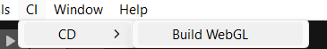

## Шаг 3. Отключение сжатия WebGL

Compression Format = Disabled.
Скриншот: 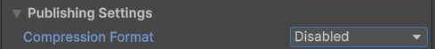

## Шаг 4. CLI-сборка

Команда:

```powershell
& "D:\Unity\Hub\Editor\6000.2.10f1\Editor\Unity.exe" -batchmode -nographics -executeMethod BuildManager.BuildWebGL -quit -logFile build_webgl.log
```

Скриншот терминала: 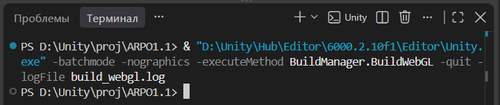

## Шаг 5. Результат сборки

В логе найдено:

```
[CI/CD] УСПЕХ! WebGL билд успешно создан.
```

Скриншот: 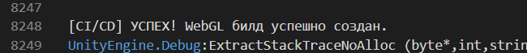

## Шаг 6. Локальный запуск

Запущено через Live Server.
Скриншот игры: 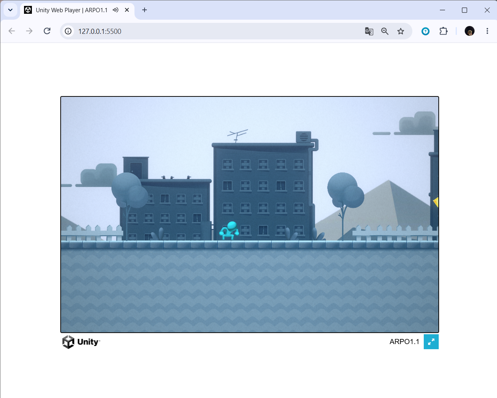

## Шаг 7. Git

Ветки: main, LR1.
Скриншот: 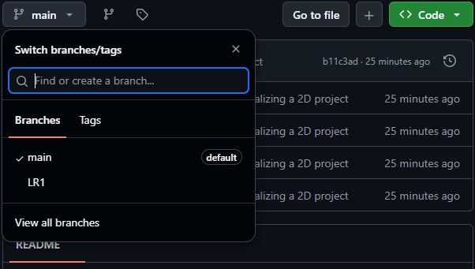

## Шаг 8. Pull Request

PR из LR1 в main.
Скриншоты: 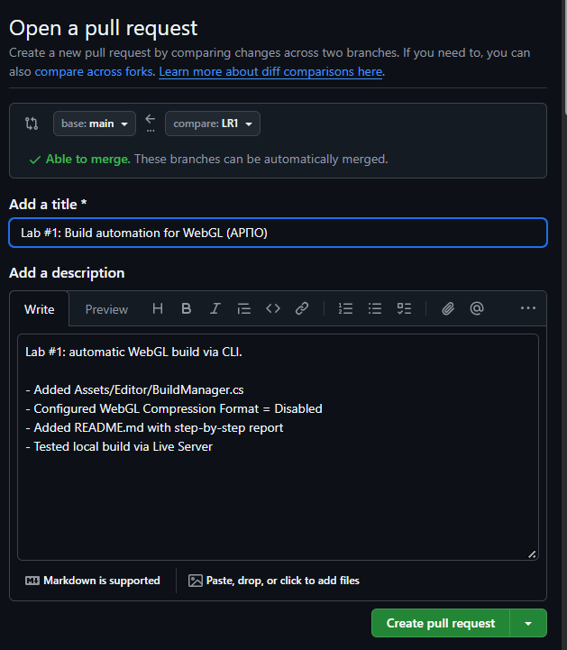 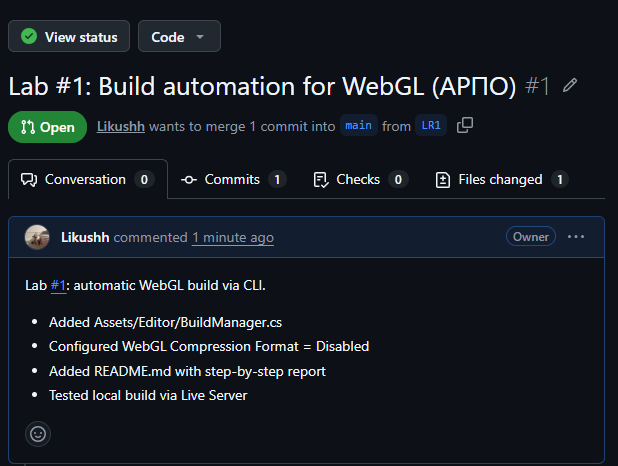 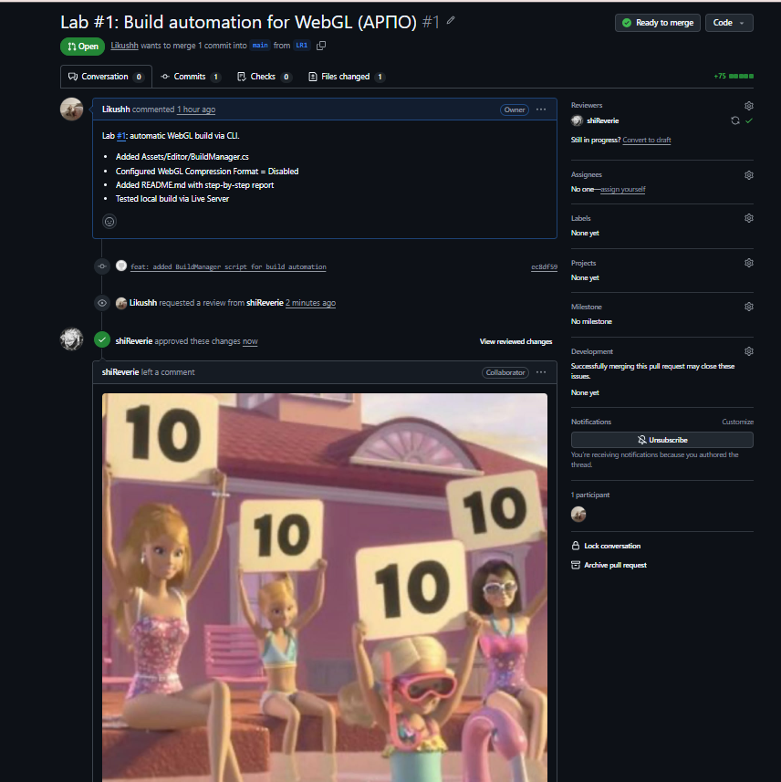

## Вывод

В ходе работы настроена автоматическая сборка Unity WebGL через CLI.

## Лабораторная работа №2. CI/CD через GitHub Actions

### Шаг 1. Резервный репозиторий

![Резервный репозиторий] 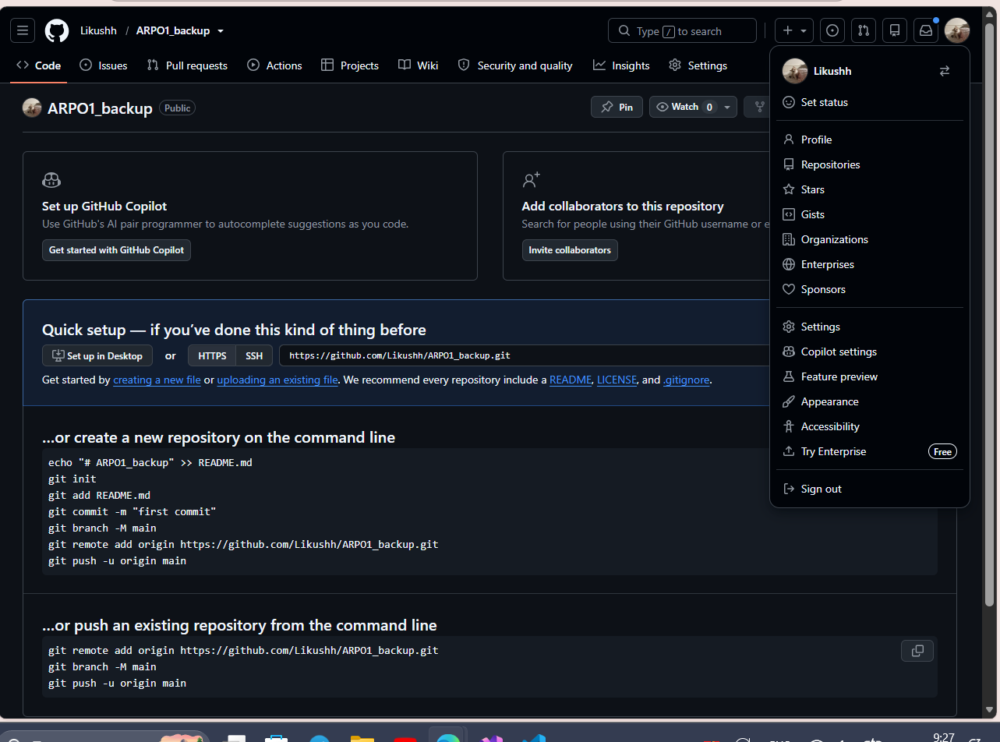

### Шаг 2. PAT-токен

![Настройки PAT]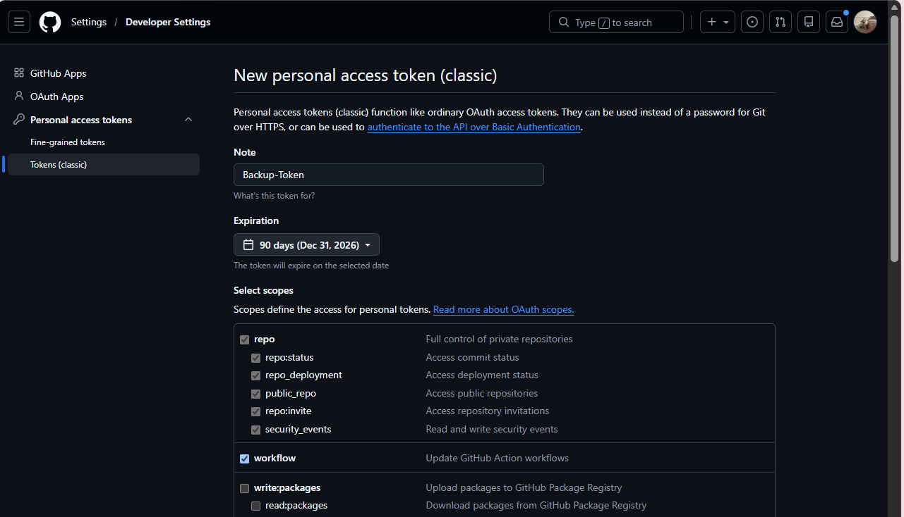

### Шаг 3. Секрет BACKUP_TOKEN

![Секрет] 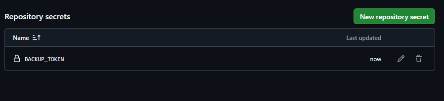

### Шаг 4. YAML-пайплайн

Файл: `.github/workflows/main.yml`
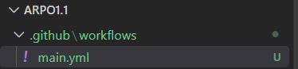

### Шаг 5. Pull Request

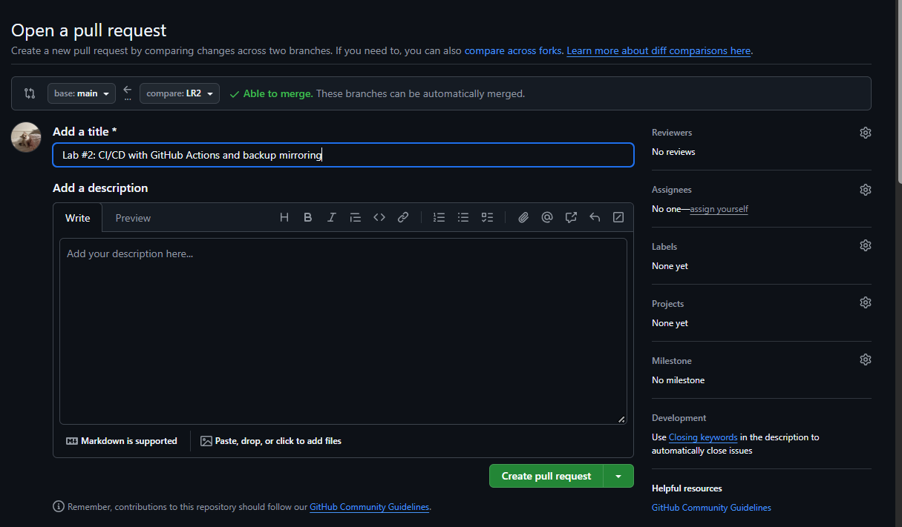
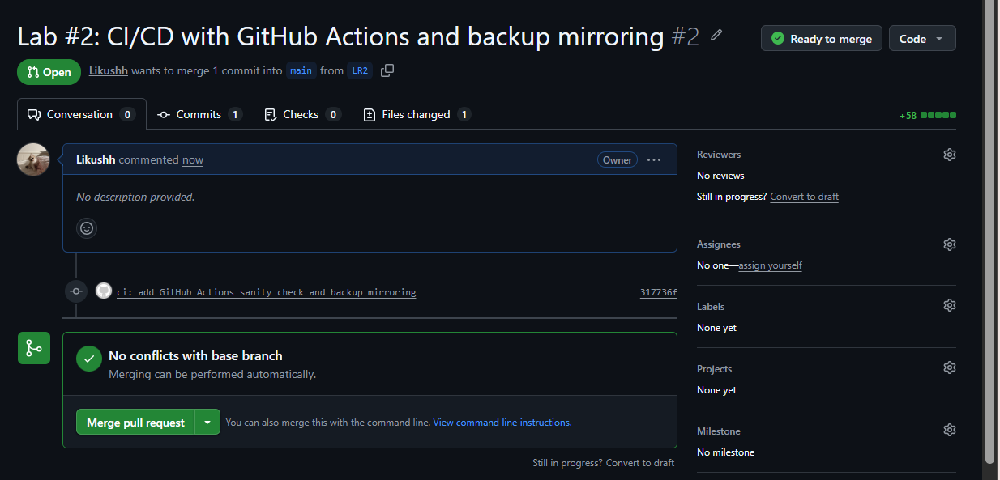
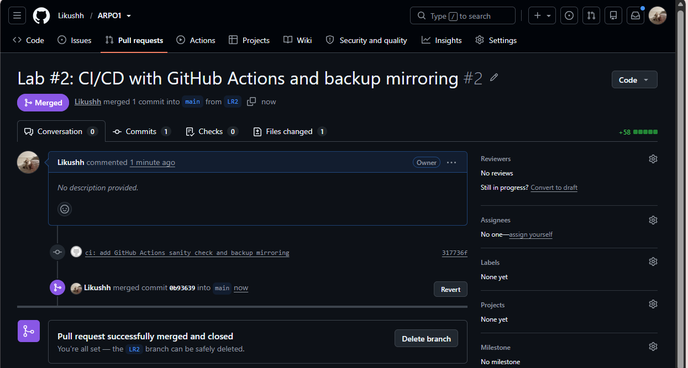

### Шаг 6. Запуск workflow

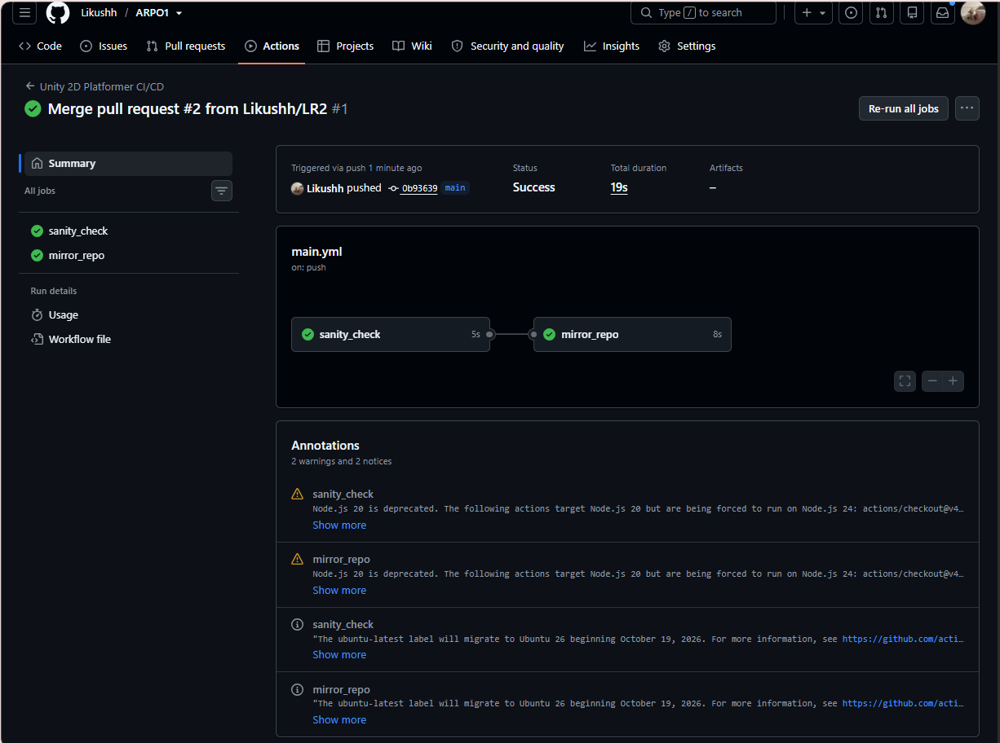

### Шаг 7. Зеркалирование

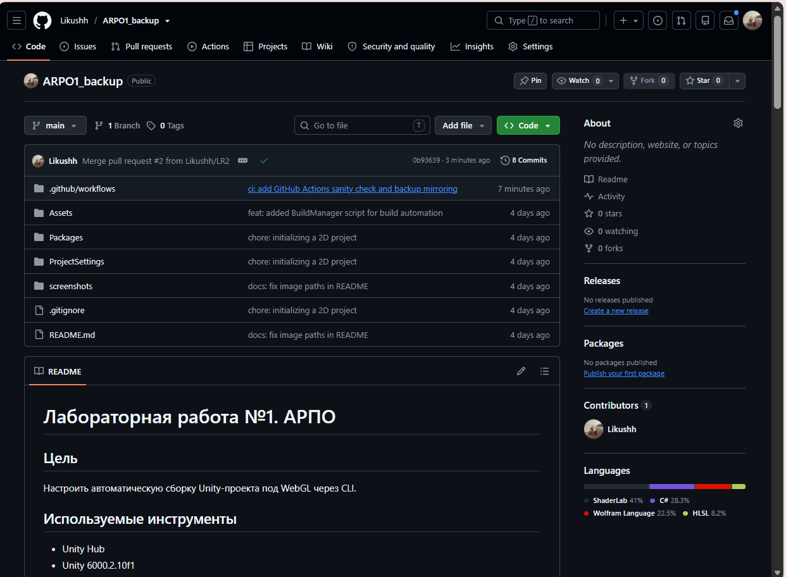

### Вывод

Настроен CI/CD пайплайн GitHub Actions: sanity check структуры проекта и автоматическое зеркалирование кода в резервный репозиторий через PAT-токен.
